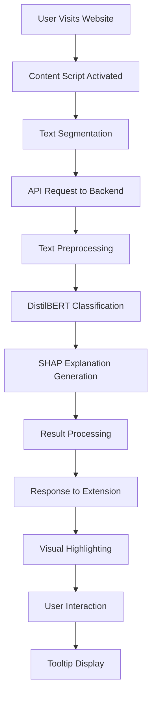

# System Architecture - Ethical Eye Extension

## 1. Architecture Overview

The Ethical Eye extension follows a **layered architecture** with clear separation of concerns, enabling modular development, testing, and maintenance. The system is designed for scalability, maintainability, and user experience optimization.

## 2. Architectural Patterns

### 2.1 Primary Patterns

- **Layered Architecture**: Clear separation between presentation, business logic, and data layers
- **Microservices**: Backend API as independent service
- **Event-Driven**: Asynchronous communication between components
- **Plugin Architecture**: Extensible Chrome extension design

### 2.2 Design Principles

- **Single Responsibility**: Each component has one clear purpose
- **Open/Closed**: Open for extension, closed for modification
- **Dependency Inversion**: High-level modules don't depend on low-level modules
- **Interface Segregation**: Clients depend only on interfaces they use

## 3. System Components

### 3.1 Presentation Layer (Chrome Extension)

```
┌─────────────────────────────────────────────────────────────┐
│                    PRESENTATION LAYER                      │
├─────────────────────────────────────────────────────────────┤
│  Chrome Extension (Manifest V3)                            │
│  ├── Popup Interface (popup.html)                          │
│  │   ├── Status Display                                    │
│  │   ├── Control Buttons                                   │
│  │   └── Settings Panel                                    │
│  ├── Content Scripts                                       │
│  │   ├── Text Segmenter                                    │
│  │   ├── Pattern Highlighter                               │
│  │   └── User Interaction Handler                          │
│  ├── Background Service Worker                             │
│  │   ├── API Communication                                 │
│  │   ├── State Management                                  │
│  │   └── Event Coordination                                │
│  └── Visual Components                                     │
│      ├── Highlight Overlays                                │
│      ├── Tooltip System                                    │
│      └── Progress Indicators                               │
└─────────────────────────────────────────────────────────────┘
```

### 3.2 Business Logic Layer (ML Processing)

```
┌─────────────────────────────────────────────────────────────┐
│                   BUSINESS LOGIC LAYER                     │
├─────────────────────────────────────────────────────────────┤
│  Machine Learning Pipeline                                 │
│  ├── Text Preprocessing                                    │
│  │   ├── Tokenization                                      │
│  │   ├── Normalization                                     │
│  │   └── Feature Extraction                                │
│  ├── Pattern Classification                                │
│  │   ├── DistilBERT Model (Text)                          │
│  │   ├── Multimodal Model v2 (Vision+Text)               │
│  │   ├── Layout Analyzer (HTML/CSS)                       │
│  │   ├── Confidence Scoring                               │
│  │   └── Category Mapping                                  │
│  ├── Explainable AI (XAI)                                 │
│  │   ├── SHAP Value Computation                            │
│  │   ├── Feature Importance                                │
│  │   └── Explanation Generation                            │
│  └── Result Processing                                     │
│      ├── Threshold Filtering                               │
│      ├── Result Aggregation                                │
│      └── Response Formatting                               │
└─────────────────────────────────────────────────────────────┘
```

### 3.3 Data Access Layer (API & Storage)

```
┌─────────────────────────────────────────────────────────────┐
│                    DATA ACCESS LAYER                       │
├─────────────────────────────────────────────────────────────┤
│  REST API (Flask)                                          │
│  ├── Request Handling                                      │
│  │   ├── Input Validation                                  │
│  │   ├── Authentication                                    │
│  │   └── Rate Limiting                                     │
│  ├── Model Management                                      │
│  │   ├── Model Loading                                     │
│  │   ├── Inference Pipeline                                │
│  │   └── Caching Strategy                                  │
│  └── Response Generation                                   │
│      ├── JSON Serialization                                │
│      ├── Error Handling                                    │
│      └── Logging                                           │
│  Local Storage (Chrome Storage API)                        │
│  ├── User Preferences                                      │
│  ├── Analysis History                                      │
│  └── Extension State                                       │
└─────────────────────────────────────────────────────────────┘
```

## 4. Data Flow Architecture

### 4.1 Primary Data Flow



### 4.2 Detailed Component Interaction

```
┌─────────────────────────────────────────────────────────────┐
│                    COMPONENT INTERACTION                    │
├─────────────────────────────────────────────────────────────┤
│  User Action                                               │
│  │                                                         │
│  ▼                                                         │
│  Content Script (content.js)                               │
│  │  ├── TextSegmenter.extractSegments()                    │
│  │  └── APIClient.analyzeSegments()                        │
│  │                                                         │
│  ▼                                                         │
│  Background Service Worker (background.js)                 │
│  │  ├── HTTP Request to Flask API                          │
│  │  └── Response Processing                                │
│  │                                                         │
│  ▼                                                         │
│  Flask API (app.py)                                        │
│  │  ├── Request Validation                                 │
│  │  ├── Model Inference                                    │
│  │  ├── SHAP Explanation                                   │
│  │  └── JSON Response                                      │
│  │                                                         │
│  ▼                                                         │
│  Pattern Highlighter (highlighter.js)                     │
│  │  ├── DOM Manipulation                                   │
│  │  ├── Visual Overlays                                    │
│  │  └── Tooltip Creation                                   │
│  │                                                         │
│  ▼                                                         │
│  User Interface Updates                                    │
│  │  ├── Popup Count Update                                 │
│  │  ├── Visual Highlighting                                │
│  │  └── Interactive Tooltips                               │
└─────────────────────────────────────────────────────────────┘
```

## 5. Technology Stack Architecture

### 5.1 Frontend Technology Stack

```
┌─────────────────────────────────────────────────────────────┐
│                   FRONTEND STACK                           │
├─────────────────────────────────────────────────────────────┤
│  Chrome Extension Platform                                 │
│  ├── Manifest V3 API                                      │
│  ├── Content Scripts API                                  │
│  ├── Storage API                                          │
│  └── Tabs API                                             │
│  Web Technologies                                          │
│  ├── HTML5 (Semantic Markup)                              │
│  ├── CSS3 (Flexbox, Grid, Animations)                     │
│  ├── JavaScript ES6+ (Modules, Promises, Async/Await)     │
│  └── Web APIs (DOM, Fetch, Intersection Observer)         │
│  UI/UX Libraries                                          │
│  ├── Custom CSS Framework                                 │
│  ├── Icon Libraries (Feather Icons)                       │
│  └── Animation Libraries (CSS Transitions)                │
└─────────────────────────────────────────────────────────────┘
```

### 5.2 Backend Technology Stack

```
┌─────────────────────────────────────────────────────────────┐
│                    BACKEND STACK                           │
├─────────────────────────────────────────────────────────────┤
│  Web Framework                                             │
│  ├── Flask (Python Web Framework)                         │
│  ├── Flask-CORS (Cross-Origin Resource Sharing)           │
│  └── Gunicorn (WSGI Server)                               │
│  Machine Learning Stack                                    │
│  ├── PyTorch (Deep Learning Framework)                    │
│  ├── Transformers (Hugging Face)                          │
│  ├── DistilBERT (Pre-trained Model)                       │
│  ├── Multimodal Model v2 (MobileViT + DistilBERT)        │
│  ├── Torchvision (Computer Vision)                        │
│  ├── SHAP (Explainable AI)                                │
│  └── BeautifulSoup + CSSUtils (Layout Analysis)           │
│  Data Processing                                           │
│  ├── NumPy (Numerical Computing)                          │
│  ├── Pandas (Data Manipulation)                           │
│  ├── Scikit-learn (ML Utilities)                          │
│  └── NLTK (Natural Language Processing)                    │
│  Infrastructure                                            │
│  ├── Docker (Containerization)                            │
│  ├── Redis (Caching)                                      │
│  └── Nginx (Reverse Proxy)                                │
└─────────────────────────────────────────────────────────────┘
```

## 6. Security Architecture

### 6.1 Security Layers

```
┌─────────────────────────────────────────────────────────────┐
│                   SECURITY ARCHITECTURE                    │
├─────────────────────────────────────────────────────────────┤
│  Application Security                                      │
│  ├── Input Validation                                      │
│  │   ├── Text Sanitization                                │
│  │   ├── Length Validation                                 │
│  │   └── Character Encoding                                │
│  ├── Output Encoding                                       │
│  │   ├── HTML Escaping                                     │
│  │   ├── JSON Sanitization                                 │
│  │   └── XSS Prevention                                    │
│  └── Error Handling                                        │
│      ├── Secure Error Messages                             │
│      ├── Logging Security                                  │
│      └── Exception Management                              │
│  Network Security                                          │
│  ├── HTTPS Enforcement                                     │
│  ├── CORS Configuration                                    │
│  ├── Rate Limiting                                         │
│  └── Request Validation                                    │
│  Data Security                                             │
│  ├── No Data Persistence                                   │
│  ├── Local Processing Only                                 │
│  ├── Memory Cleanup                                        │
│  └── Privacy by Design                                     │
└─────────────────────────────────────────────────────────────┘
```

### 6.2 Privacy Architecture

```
┌─────────────────────────────────────────────────────────────┐
│                   PRIVACY ARCHITECTURE                     │
├─────────────────────────────────────────────────────────────┤
│  Data Minimization                                         │
│  ├── No Personal Data Collection                           │
│  ├── No Data Storage                                       │
│  ├── No Analytics Tracking                                 │
│  └── No Third-party Services                               │
│  Local Processing                                           │
│  ├── Client-side Analysis                                  │
│  ├── No Server Communication                               │
│  ├── No Data Transmission                                  │
│  └── Complete User Control                                 │
│  Transparency                                               │
│  ├── Open Source Code                                      │
│  ├── Clear Privacy Policy                                  │
│  ├── User Consent                                          │
│  └── Data Usage Explanation                                │
└─────────────────────────────────────────────────────────────┘
```

## 7. Scalability Architecture

### 7.1 Horizontal Scaling

```
┌─────────────────────────────────────────────────────────────┐
│                   SCALABILITY ARCHITECTURE                 │
├─────────────────────────────────────────────────────────────┤
│  Load Balancing                                            │
│  ├── Nginx Load Balancer                                   │
│  ├── Round-robin Distribution                              │
│  ├── Health Checks                                         │
│  └── Failover Mechanisms                                   │
│  Microservices Architecture                                │
│  ├── API Gateway                                           │
│  ├── Service Discovery                                     │
│  ├── Circuit Breakers                                      │
│  └── Distributed Caching                                   │
│  Container Orchestration                                   │
│  ├── Docker Containers                                     │
│  ├── Kubernetes Deployment                                 │
│  ├── Auto-scaling                                          │
│  └── Resource Management                                   │
└─────────────────────────────────────────────────────────────┘
```

### 7.2 Performance Optimization

```
┌─────────────────────────────────────────────────────────────┐
│                 PERFORMANCE ARCHITECTURE                   │
├─────────────────────────────────────────────────────────────┤
│  Caching Strategy                                          │
│  ├── Model Caching                                         │
│  ├── Result Caching                                        │
│  ├── CDN Integration                                       │
│  └── Memory Optimization                                   │
│  Asynchronous Processing                                   │
│  ├── Non-blocking I/O                                      │
│  ├── Event-driven Architecture                             │
│  ├── Background Processing                                 │
│  └── Queue Management                                      │
│  Resource Optimization                                     │
│  ├── Model Quantization                                    │
│  ├── Batch Processing                                      │
│  ├── Lazy Loading                                          │
│  └── Memory Management                                     │
└─────────────────────────────────────────────────────────────┘
```

## 8. Deployment Architecture

### 8.1 Development Environment

```
┌─────────────────────────────────────────────────────────────┐
│                DEVELOPMENT ARCHITECTURE                    │
├─────────────────────────────────────────────────────────────┤
│  Local Development                                         │
│  ├── Flask Development Server                              │
│  ├── Chrome Extension (Unpacked)                           │
│  ├── Hot Reloading                                         │
│  └── Debug Tools                                           │
│  Testing Environment                                       │
│  ├── Unit Tests                                            │
│  ├── Integration Tests                                     │
│  ├── End-to-end Tests                                      │
│  └── Performance Tests                                     │
│  CI/CD Pipeline                                            │
│  ├── GitHub Actions                                        │
│  ├── Automated Testing                                     │
│  ├── Code Quality Checks                                   │
│  └── Deployment Automation                                 │
└─────────────────────────────────────────────────────────────┘
```

### 8.2 Production Environment

```
┌─────────────────────────────────────────────────────────────┐
│                 PRODUCTION ARCHITECTURE                    │
├─────────────────────────────────────────────────────────────┤
│  Cloud Infrastructure                                      │
│  ├── AWS/GCP/Azure                                         │
│  ├── Container Registry                                    │
│  ├── Load Balancer                                         │
│  └── CDN Distribution                                      │
│  Application Deployment                                    │
│  ├── Docker Containers                                     │
│  ├── Kubernetes Pods                                       │
│  ├── Service Mesh                                          │
│  └── Monitoring Stack                                      │
│  Extension Distribution                                    │
│  ├── Chrome Web Store                                      │
│  ├── Automated Updates                                     │
│  ├── Version Management                                    │
│  └── User Analytics                                        │
└─────────────────────────────────────────────────────────────┘
```

## 9. Monitoring and Observability

### 9.1 Monitoring Stack

```
┌─────────────────────────────────────────────────────────────┐
│                 MONITORING ARCHITECTURE                    │
├─────────────────────────────────────────────────────────────┤
│  Application Monitoring                                    │
│  ├── Performance Metrics                                   │
│  ├── Error Tracking                                        │
│  ├── User Experience                                       │
│  └── Business Metrics                                       │
│  Infrastructure Monitoring                                 │
│  ├── System Resources                                      │
│  ├── Network Performance                                   │
│  ├── Database Health                                       │
│  └── Service Dependencies                                  │
│  Logging and Alerting                                      │
│  ├── Centralized Logging                                   │
│  ├── Log Aggregation                                       │
│  ├── Alert Rules                                           │
│  └── Incident Response                                     │
└─────────────────────────────────────────────────────────────┘
```

## 10. Quality Attributes

### 10.1 Performance Requirements

- **Response Time**: < 2 seconds for page analysis
- **Throughput**: 100+ concurrent users
- **Resource Usage**: < 100MB memory footprint
- **Availability**: 99.9% uptime

### 10.2 Reliability Requirements

- **Fault Tolerance**: Graceful degradation on errors
- **Error Recovery**: Automatic retry mechanisms
- **Data Integrity**: Consistent results across requests
- **Backup Strategy**: Model and configuration backups

### 10.3 Usability Requirements

- **User Interface**: Intuitive and responsive design
- **Accessibility**: WCAG 2.1 AA compliance
- **Documentation**: Comprehensive user guides
- **Support**: Community and technical support

### 10.4 Maintainability Requirements

- **Code Quality**: Clean, documented, testable code
- **Modularity**: Loosely coupled, highly cohesive components
- **Extensibility**: Easy to add new features
- **Documentation**: Comprehensive technical documentation

---

_This System Architecture document provides a comprehensive overview of the Ethical Eye extension's architectural design, including component relationships, technology choices, and quality attributes._
