# High Level Model Diagram - Ethical Eye Extension

## 1. System Overview Diagram

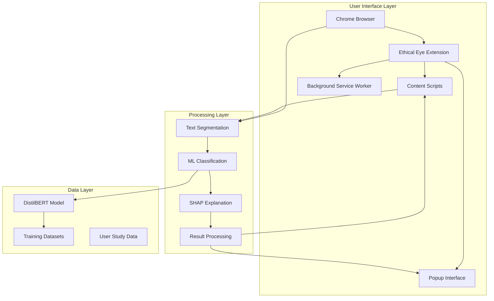

## 2. Component Interaction Diagram

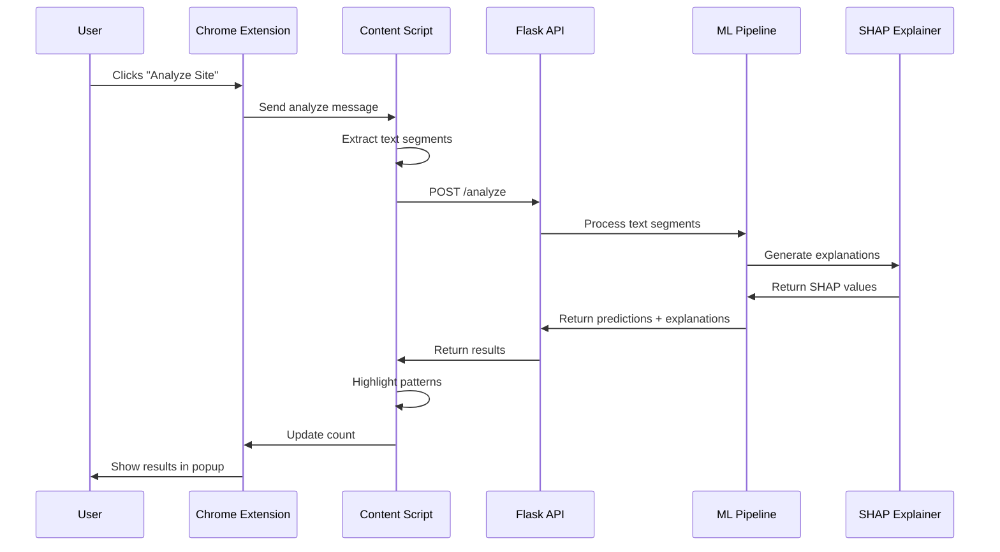

## 3. Machine Learning Pipeline Diagram

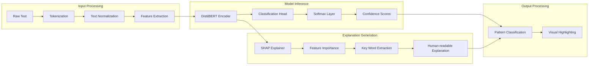

## 4. Data Flow Architecture

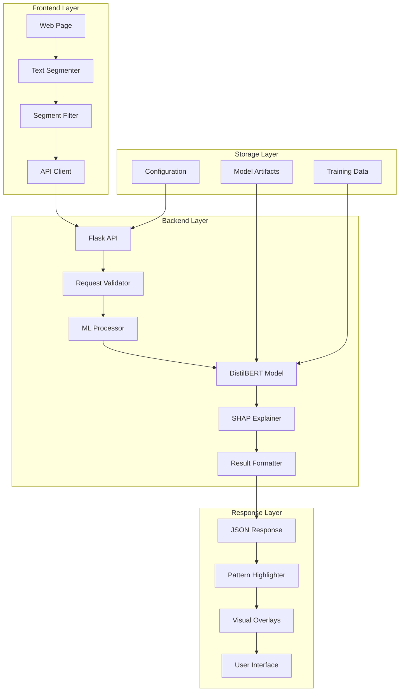

## 5. Dark Pattern Classification Model

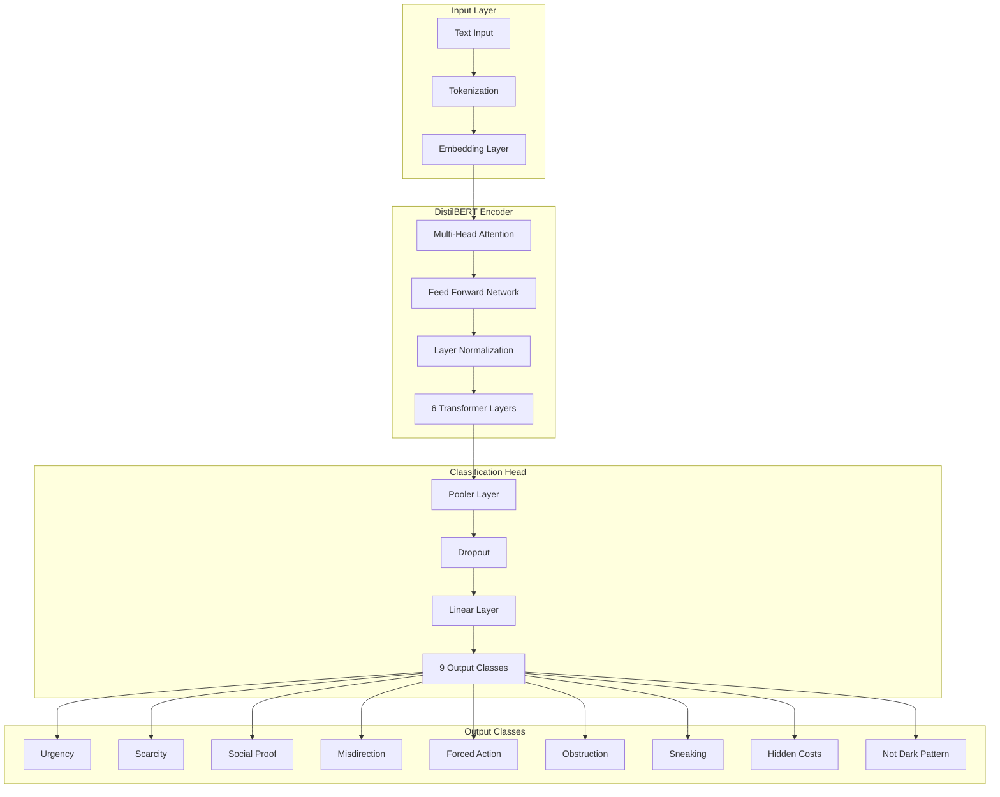

## 6. SHAP Explanation Model

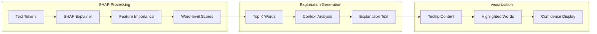

## 7. User Interaction Flow

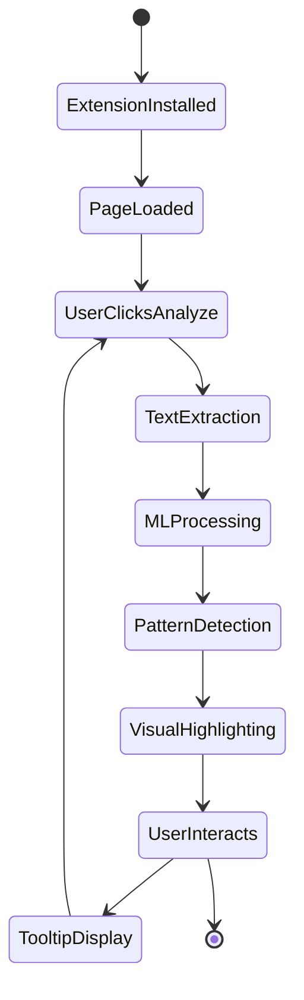

## 8. System Deployment Architecture

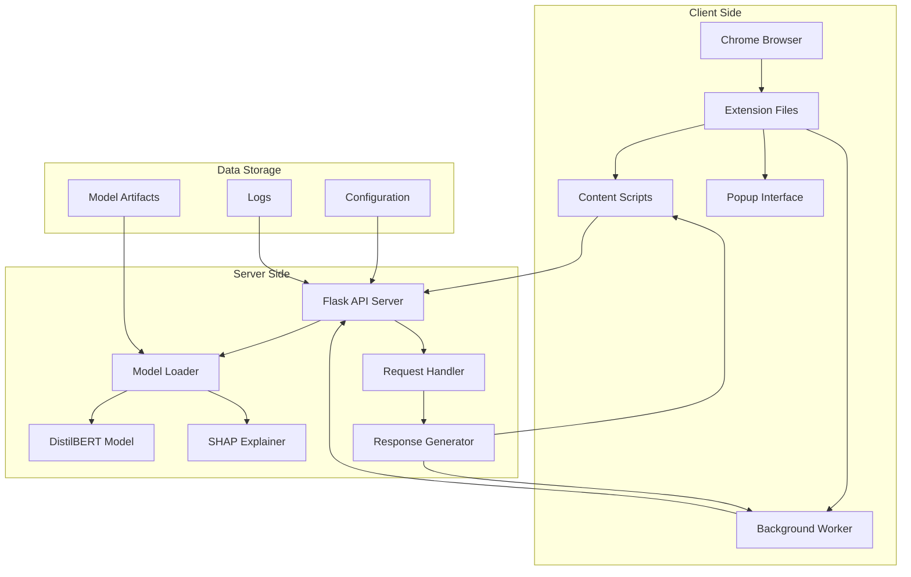

## 9. Performance Monitoring Model

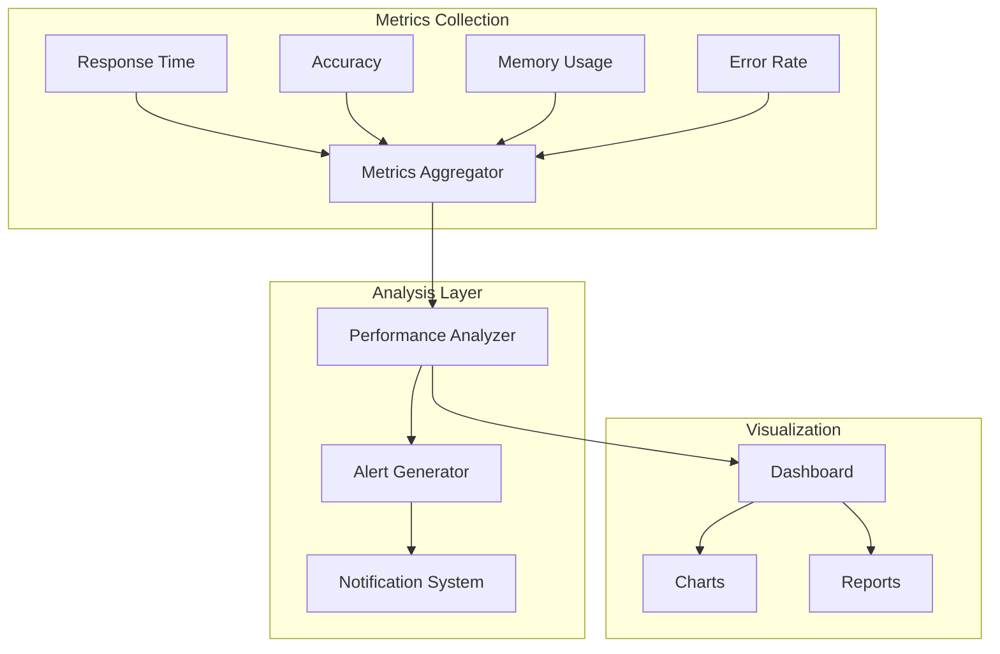

## 10. Security and Privacy Model

```mermaid
graph TB
    subgraph "Security Layers"
        A[Input Validation] --> B[Output Encoding]
        B --> C[Error Handling]
        C --> D[Access Control]
    end
    
    subgraph "Privacy Protection"
        E[No Data Collection] --> F[Local Processing]
        F --> G[Memory Cleanup]
        G --> H[User Consent]
    end
    
    subgraph "Compliance"
        I[GDPR Compliance] --> J[Privacy by Design]
        J --> K[Data Minimization]
        K --> L[Transparency]
    end
```

## 11. Model Training Pipeline

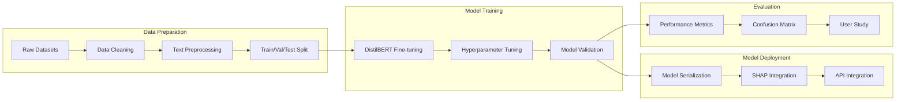

## 12. Extension Architecture Layers

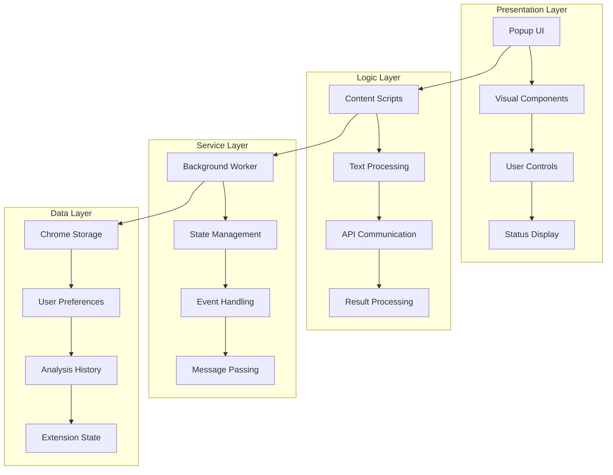

## 13. API Request/Response Model

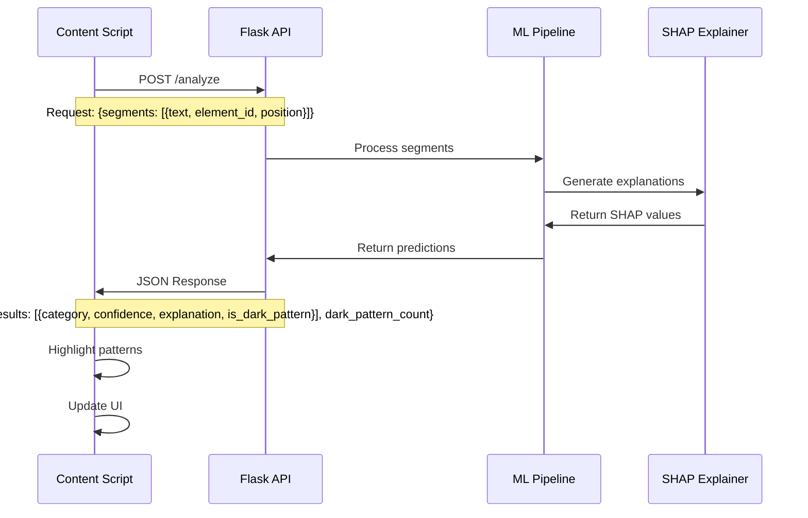

## 14. Error Handling Model

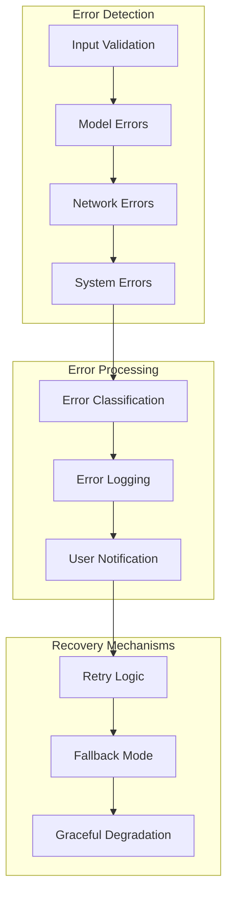

## 15. User Study Data Model

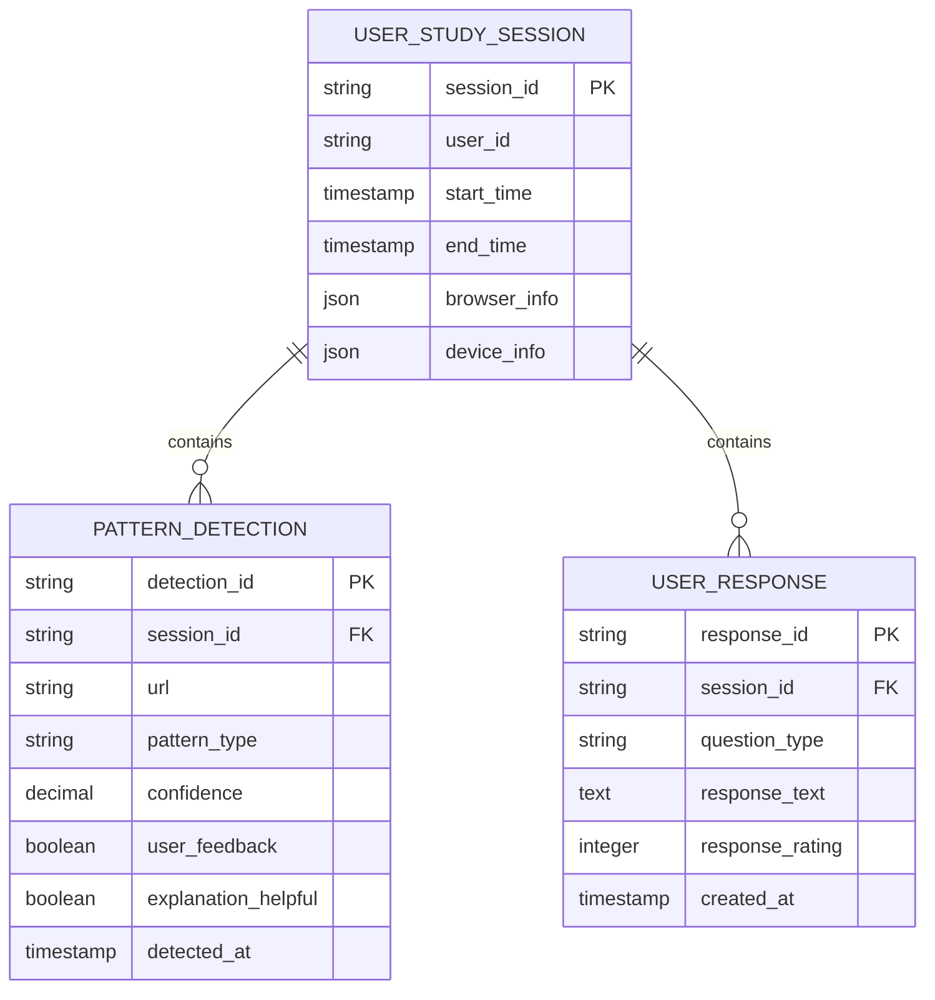

---

*This High Level Model Diagram document provides comprehensive visual representations of the Ethical Eye extension's architecture, data flow, and component relationships using Mermaid diagrams.*
