# Presentation Diagrams - Ethical Eye Extension

## 🎯 Overview

This document contains all the diagrams and visualizations needed for presenting the Ethical Eye research project. These diagrams are designed for academic presentations, conference talks, and research demonstrations.

---

## 1. Project Overview & Problem Statement

### 1.1 Dark Patterns Problem Visualization

```mermaid
graph TB
    subgraph "E-commerce Websites"
        A[User Visits Site] --> B[Dark Patterns Present]
        B --> C[Manipulative Design]
        C --> D[User Confusion]
        D --> E[Unintended Actions]
        E --> F[Privacy Violations]
        E --> G[Unwanted Purchases]
        E --> H[Subscription Traps]
    end

    subgraph "Current Solutions"
        I[Black-box Detection] --> J[No Explanations]
        J --> K[User Skepticism]
        K --> L[Limited Learning]
    end

    subgraph "Our Solution"
        M[Ethical Eye Extension] --> N[Transparent Detection]
        N --> O[SHAP Explanations]
        O --> P[User Education]
        P --> Q[Digital Literacy]
    end

    style B fill:#ff6b6b
    style C fill:#ff6b6b
    style D fill:#ff6b6b
    style E fill:#ff6b6b
    style M fill:#4ecdc4
    style N fill:#4ecdc4
    style O fill:#4ecdc4
    style P fill:#4ecdc4
    style Q fill:#4ecdc4
```

### 1.2 Research Objectives

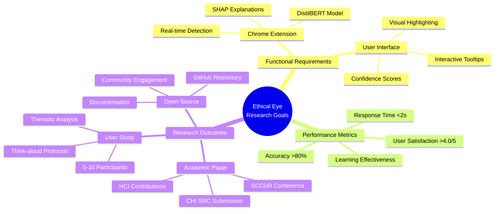

---

## 2. System Architecture Overview

### 2.1 High-Level System Architecture

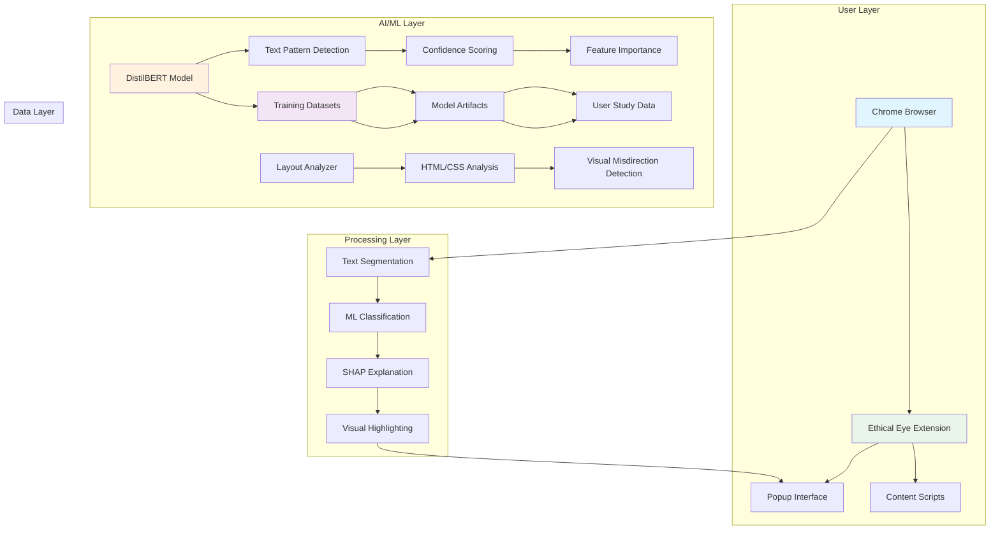

### 2.2 Component Interaction Flow

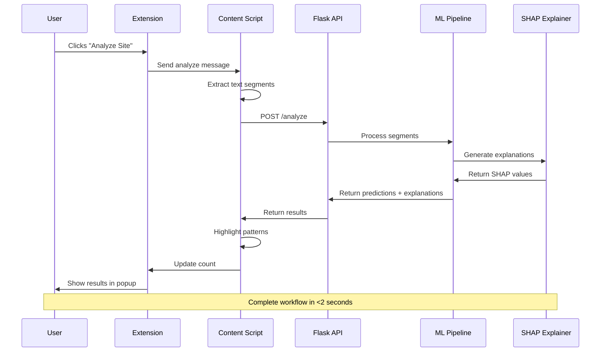

---

## 3. Machine Learning Pipeline

### 3.1 ML Pipeline Architecture

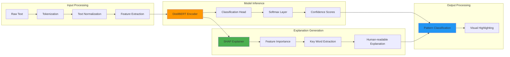

### 3.2 DistilBERT Model Architecture

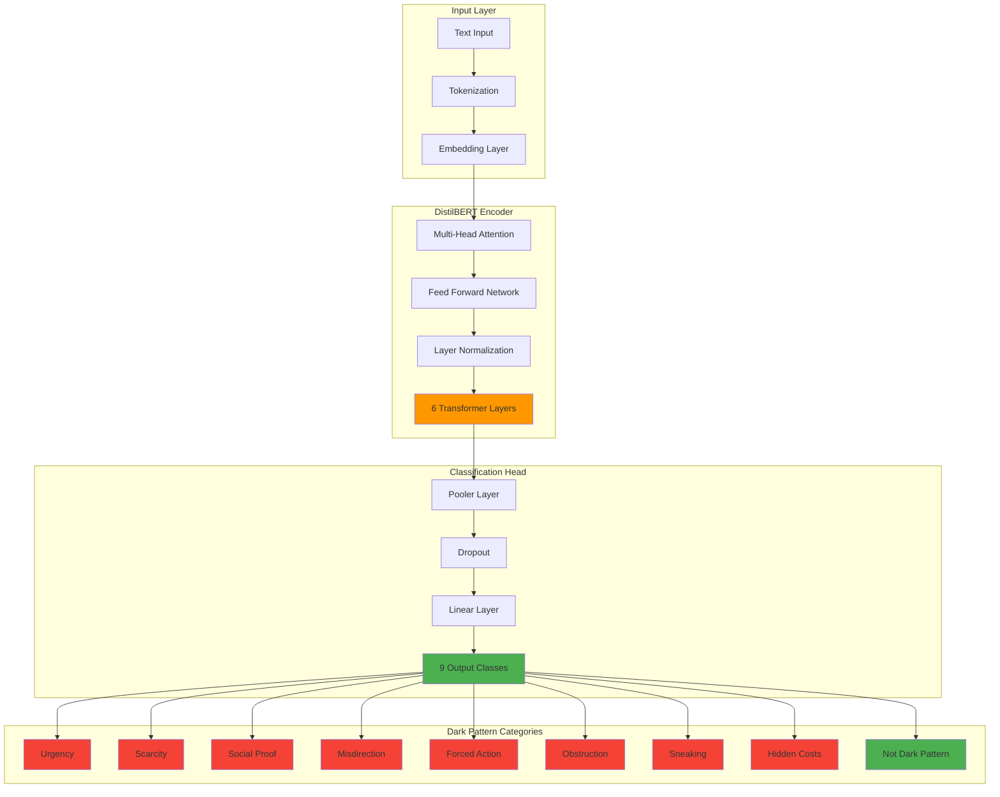

---

## 4. Explainable AI (XAI) Framework

### 4.1 SHAP Explanation Process

```mermaid
graph LR
    subgraph "SHAP Processing"
        A[Text Tokens] --> B[SHAP Explainer]
        B --> C[Feature Importance]
        C --> D[Word-level Scores]
    end

    subgraph "Explanation Generation"
        D --> E[Top K Words]
        E --> F[Context Analysis]
        F --> G[Explanation Text]
    end

    subgraph "Visualization"
        G --> H[Tooltip Content]
        H --> I[Highlighted Words]
        I --> J[Confidence Display]
    end

    subgraph "User Education"
        J --> K[Pattern Description]
        K --> L[Learning Resources]
        L --> M[Digital Literacy]
    end

    style B fill:#4caf50
    style G fill:#2196f3
    style J fill:#ff9800
    style M fill:#9c27b0
```

### 4.2 Explanation Example Flow

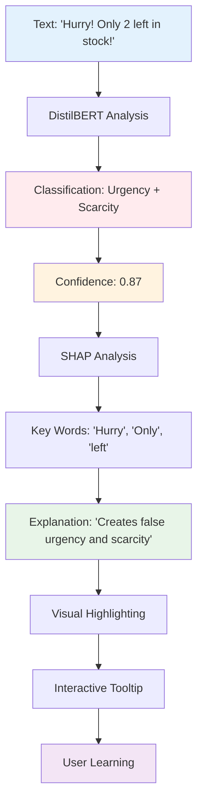

---

## 5. User Experience Flow

### 5.1 Complete User Journey

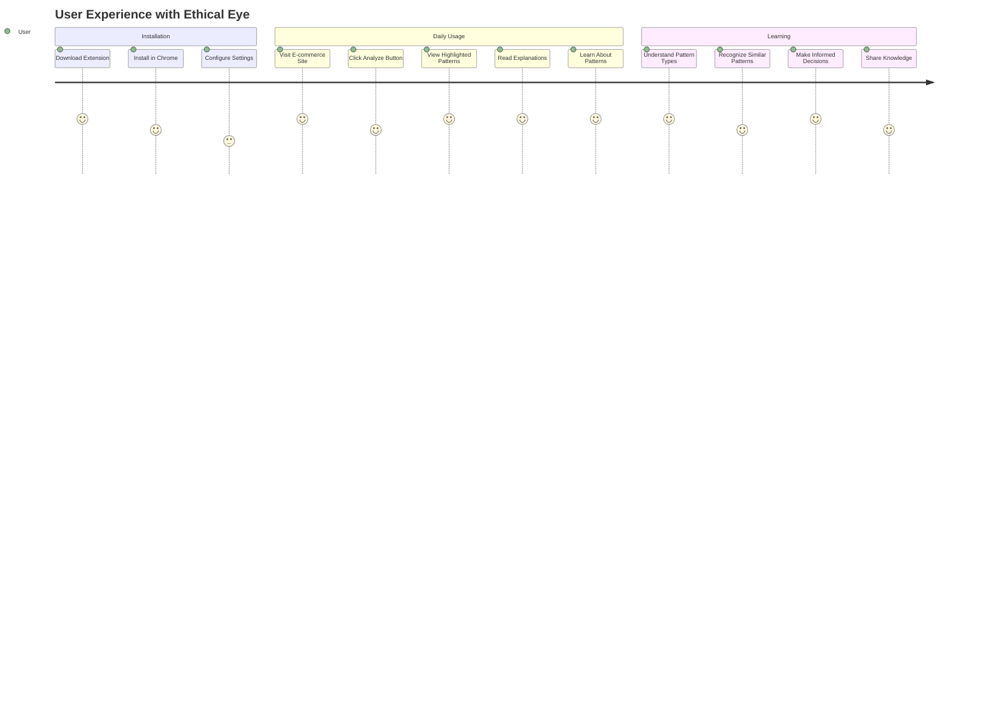

### 5.2 User Interface Flow

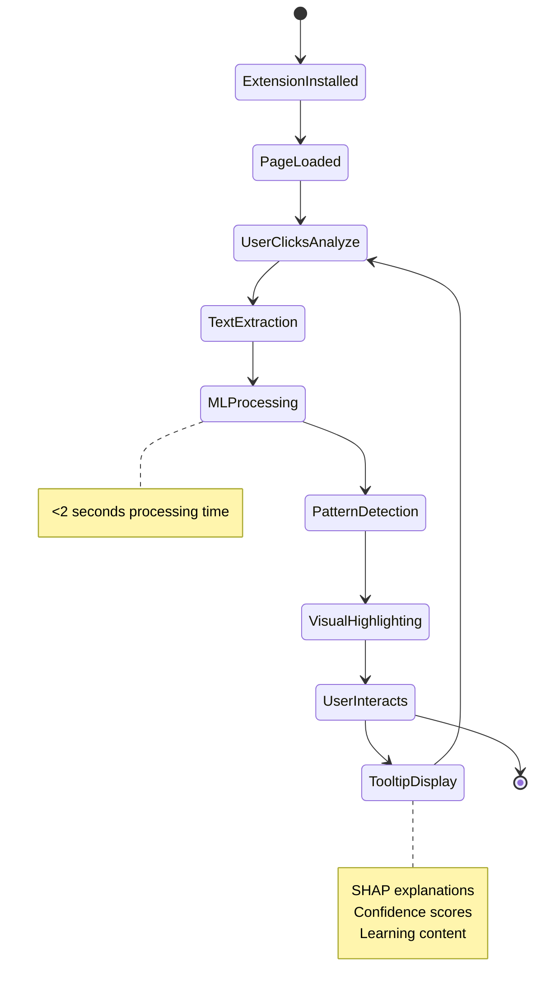

---

## 6. Research Methodology

### 6.1 Evaluation Framework

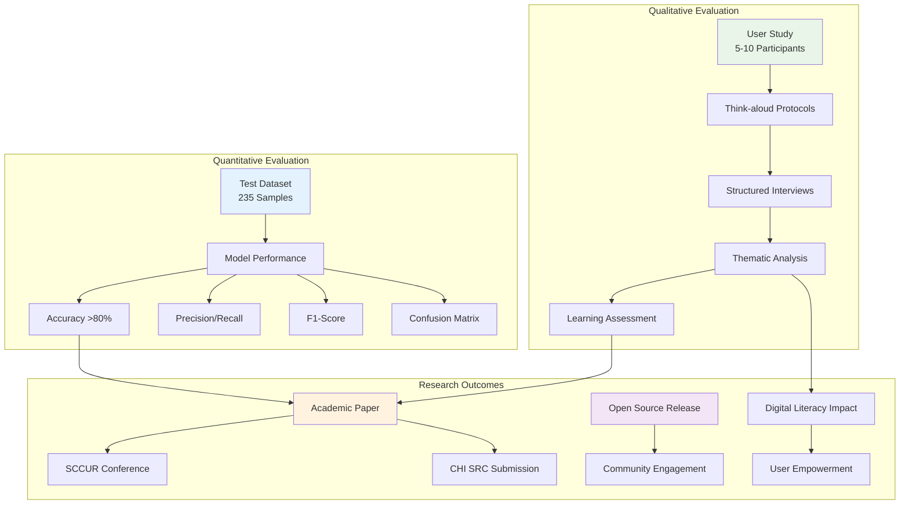

### 6.2 User Study Design

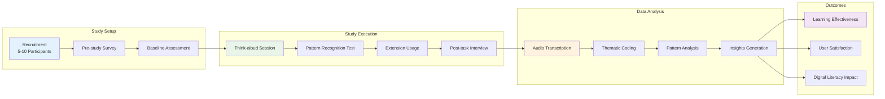

---

## 7. Performance Metrics

### 7.1 System Performance Dashboard

```mermaid
graph TB
    subgraph "Technical Metrics"
        A[Response Time<br/><2 seconds] --> B[Accuracy<br/>>80%]
        B --> C[Memory Usage<br/><100MB]
        C --> D[CPU Usage<br/>Minimal]
    end

    subgraph "User Experience Metrics"
        E[User Satisfaction<br/>>4.0/5] --> F[Learning Effectiveness<br/>Improved]
        F --> G[Usage Frequency<br/>Daily]
        G --> H[Retention Rate<br/>>60%]
    end

    subgraph "Research Metrics"
        I[Pattern Detection<br/>8 Categories] --> J[Explanation Quality<br/>SHAP-based]
        J --> K[Digital Literacy<br/>Enhanced]
        K --> L[User Empowerment<br/>Measured]
    end

    style A fill:#4caf50
    style B fill:#4caf50
    style E fill:#2196f3
    style I fill:#ff9800
```

### 7.2 Model Performance Visualization

```mermaid
graph LR
    subgraph "Training Phase"
        A[Training Data<br/>1000+ samples] --> B[DistilBERT Fine-tuning]
        B --> C[Validation<br/>80/20 split]
        C --> D[Model Optimization]
    end

    subgraph "Testing Phase"
        D --> E[Test Dataset<br/>235 samples]
        E --> F[Performance Metrics]
        F --> G[Confusion Matrix]
        G --> H[Category-wise Analysis]
    end

    subgraph "Deployment Phase"
        H --> I[Real-world Testing]
        I --> J[User Feedback]
        J --> K[Continuous Improvement]
    end

    style A fill:#e3f2fd
    style E fill:#e8f5e8
    style I fill:#fff3e0
```

---

## 8. Dark Pattern Categories

### 8.1 Pattern Classification Tree

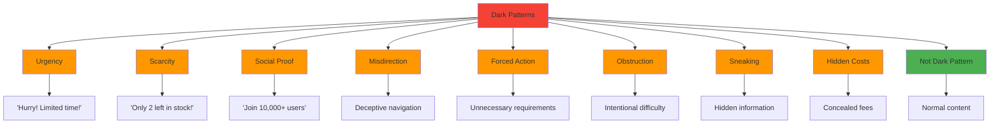

### 8.2 Pattern Detection Examples

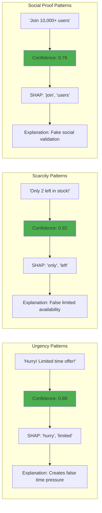

---

## 9. Technology Stack

### 9.1 Complete Technology Stack

```mermaid
graph TB
    subgraph "Frontend Technologies"
        A[Chrome Extension<br/>Manifest V3] --> B[HTML5/CSS3/JavaScript]
        B --> C[Chrome Extension APIs]
        C --> D[Custom UI Components]
    end

    subgraph "Backend Technologies"
        E[Flask API Server] --> F[Python 3.8+]
        F --> G[PyTorch Framework]
        G --> H[Transformers Library]
    end

    subgraph "ML/AI Technologies"
        I[DistilBERT Model] --> J[SHAP Explanations]
        J --> K[Scikit-learn]
        K --> L[NumPy/Pandas]
        M[Multimodal Model v2] --> N[MobileViT + DistilBERT]
        N --> O[PyTorch Vision]
        P[Layout Analyzer] --> Q[BeautifulSoup + CSSUtils]
    end

    subgraph "Development Tools"
        M[Git Version Control] --> N[Docker Containerization]
        N --> O[Jest/Pytest Testing]
        O --> P[GitHub Actions CI/CD]
    end

    style A fill:#e3f2fd
    style E fill:#e8f5e8
    style I fill:#fff3e0
    style M fill:#f3e5f5
```

### 9.2 Development Workflow

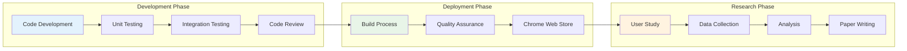

---

## 10. Future Roadmap

### 10.1 Research Timeline

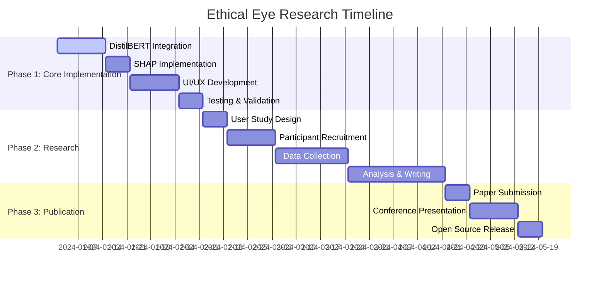

### 10.2 Future Enhancements

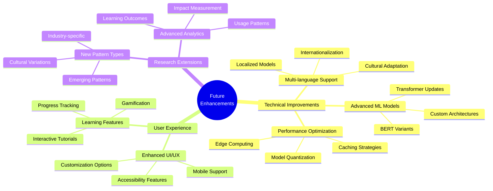

---

## 11. Impact and Contributions

### 11.1 Research Impact

```mermaid
graph TB
    subgraph "Academic Contributions"
        A[Explainable AI for HCI] --> B[Transparent ML Systems]
        B --> C[User Empowerment]
        C --> D[Digital Literacy]
    end

    subgraph "Practical Impact"
        E[Consumer Protection] --> F[Informed Decision Making]
        F --> G[Privacy Awareness]
        G --> H[Ethical Design]
    end

    subgraph "Industry Impact"
        I[Design Guidelines] --> J[Ethical Standards]
        J --> K[Regulatory Compliance]
        K --> L[User Trust]
    end

    D --> E
    H --> I

    style A fill:#e3f2fd
    style E fill:#e8f5e8
    style I fill:#fff3e0
```

### 11.2 Open Source Ecosystem

```mermaid
graph LR
    subgraph "Open Source Benefits"
        A[Transparency] --> B[Community Trust]
        B --> C[Collaborative Development]
        C --> D[Knowledge Sharing]
    end

    subgraph "Community Engagement"
        D --> E[Developer Contributions]
        E --> F[User Feedback]
        F --> G[Continuous Improvement]
    end

    subgraph "Research Impact"
        G --> H[Reproducible Research]
        H --> I[Academic Collaboration]
        I --> J[Industry Adoption]
    end

    style A fill:#4caf50
    style E fill:#2196f3
    style H fill:#ff9800
```

---

## 12. Presentation Summary

### 12.1 Key Takeaways

```mermaid
graph TB
    subgraph "Problem Solved"
        A[Dark Pattern Detection] --> B[Transparent Explanations]
        B --> C[User Education]
        C --> D[Digital Literacy]
    end

    subgraph "Technical Innovation"
        E[DistilBERT + SHAP] --> F[Real-time Analysis]
        F --> G[Confidence Scoring]
        G --> H[Interactive Learning]
    end

    subgraph "Research Contribution"
        I[Explainable AI] --> J[User Empowerment]
        J --> K[Academic Publication]
        K --> L[Open Source Impact]
    end

    D --> E
    H --> I

    style A fill:#f44336
    style E fill:#4caf50
    style I fill:#2196f3
```

### 12.2 Call to Action

```mermaid
graph LR
    A[Install Extension] --> B[Try on E-commerce Sites]
    B --> C[Learn About Patterns]
    C --> D[Share Knowledge]
    D --> E[Contribute to Research]
    E --> F[Build Ethical Web]

    style A fill:#4caf50
    style C fill:#2196f3
    style E fill:#ff9800
    style F fill:#9c27b0
```

---

## 🎯 Presentation Usage Guide

### **Opening Slides (5-7 minutes)**

- Use **Problem Statement** diagram (Section 1.1)
- Show **Research Objectives** mindmap (Section 1.2)
- Present **System Architecture** overview (Section 2.1)

### **Technical Deep Dive (10-12 minutes)**

- Explain **ML Pipeline** (Section 3.1)
- Demonstrate **DistilBERT Architecture** (Section 3.2)
- Show **SHAP Explanation Process** (Section 4.1)

### **User Experience (5-7 minutes)**

- Present **User Journey** (Section 5.1)
- Show **UI Flow** (Section 5.2)
- Demonstrate **Pattern Examples** (Section 8.2)

### **Research Methodology (8-10 minutes)**

- Explain **Evaluation Framework** (Section 6.1)
- Detail **User Study Design** (Section 6.2)
- Show **Performance Metrics** (Section 7.1)

### **Results & Impact (5-7 minutes)**

- Present **Research Impact** (Section 11.1)
- Show **Future Roadmap** (Section 10.1)
- End with **Call to Action** (Section 12.2)

### **Q&A Preparation**

- Keep **Technology Stack** (Section 9.1) ready
- Have **Dark Pattern Categories** (Section 8.1) available
- Prepare **Future Enhancements** (Section 10.2) for discussion

---

_These diagrams are designed to be presentation-ready and can be easily exported or screenshotted for use in slides, posters, or conference presentations._
